# Chuka University Automated Timetabling System

## Overview

The **Chuka University Timetabling & Examinations System** is a comprehensive Django-based web application for managing academic timetables, exam schedules, course allocations, resits, and related administrative workflows. The system supports multi-campus scheduling, ODEL/distance learning, automated conflict detection, resit scheduling, PDF/CSV export, in-system documentation, a chatbot feedback widget, and full role-based access for every university stakeholder — from Sudo Admin down to Class Rep.

It is organised as **22 Django apps** under one project (`university_timetable_system`), each owning a clear slice of the domain (rooms, programs, allocations, timetables, resits, exports, notifications, etc.), all wired together through a single RBAC layer (`core/rbac.py`) and a shared `auth.User` / `auth.Group` model.

---

## Table of Contents

- [Features](#features)
- [Technology Stack](#technology-stack)
- [System Architecture](#system-architecture)
- [Django Apps Reference](#django-apps-reference)
- [Entity-Relationship Diagrams (ERDs)](#entity-relationship-diagrams-erds)
- [RBAC — Role-Based Access Control](#rbac--role-based-access-control)
- [Request Lifecycle](#request-lifecycle)
- [Project Structure](#project-structure)
- [Template Inheritance](#template-inheritance)
- [Local Development (without Docker)](#local-development-without-docker)
- [Docker Deployment](#docker-deployment)
- [Environment Variables Reference](#environment-variables-reference)
- [Further Documentation](#further-documentation)
- [Author & License](#author--license)

---

## Features

- Automated timetable generation with conflict-aware scheduling algorithms (regular, exam, lab, dual-campus, ODEL, resit)
- Dual-campus and multi-campus timetable support with cross-campus tracking
- Exam timetable auto-scheduling with shared-venue and merged-group conflict detection
- **Resit scheduling module** — student-driven resit registration, COD-managed resit course allocation, manual + auto resit timetabling, resit PDF publishing
- ODEL/distance-learning timetable management
- Role-based access for: Sudo Admin, DVC, Dean, COD, Director of Timetabling, Timetabler, Lecturer, Class Rep, Student, Staff
- Course allocation with lecturer–course mapping, program enrollment, and lab allocation
- Room/venue management with building, lab, and venue-specialization support
- PDF and CSV export of timetables, exam schedules, resit timetables, and course lists
- Smart bulk import/export for course allocations and resit data
- Notification system with group/user targeting and PDF delivery
- In-system **Documentation module** (categories, pages, sections, code examples, ratings, bookmarks, change log)
- Floating chatbot feedback widget on public pages
- Bilingual (English/French), time-of-day aware **motivational ticker** on the homepage
- Mess/canteen management module
- Centralized activity logging and audit trail (`core.ActivityLog`)
- **Fully Dockerised** — one-command deployment with MySQL, Gunicorn & Nginx

---

## Technology Stack

### Backend
- Python 3.11+
- Django 4.2 (with `djangorestframework`, `django-import-export`, `django-ratelimit`)
- MySQL 8.0 (production) / SQLite (quick local dev — see settings.py for the commented-out config)

### PDF & Reporting
- ReportLab
- WeasyPrint

### Other Key Libraries
- Pillow (image handling)
- Pandas, openpyxl (scheduling algorithms, data export)
- boto3 (optional S3 storage)
- requests / urllib3 (HTTP, notification webhooks)
- whitenoise (static file serving in production)
- gunicorn (production WSGI server)

### Frontend
- HTML5, CSS3, JavaScript (vanilla + jQuery)
- Bootstrap Icons, Font Awesome 6
- Google Fonts (Inter, Source Serif 4)
- Custom CSS design system (`website.css`, `panel.css`, `dashboard.css`, `base.css`)

---

## System Architecture

High-level view of how a request flows from the browser through Nginx, Django, and into the database — and how the major app groups relate to one another.

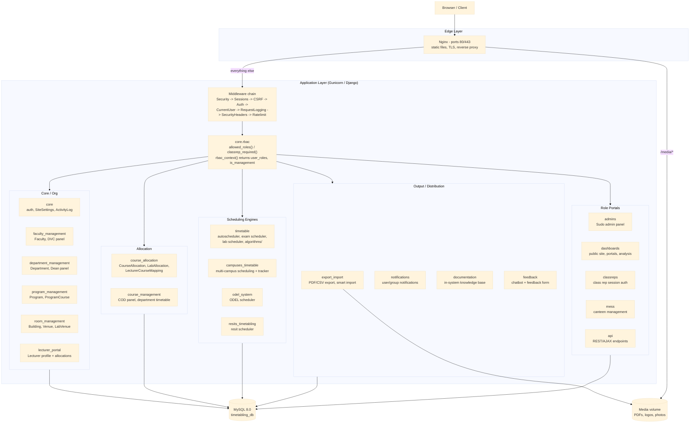

---

## Django Apps Reference

| App | Purpose | Key URL prefix(es) |
|---|---|---|
| `core` | Authentication, RBAC engine, middleware, site settings, email utilities, activity log | `/login/`, `/logout/`, `/password-reset/` |
| `admins` | Sudo admin panel — manage DVCs, CODs, accounts, timetablers, resit import (admin) | `/sudo/`, `/sudo-dashboard/` |
| `api` | REST/AJAX endpoints (timetable data, conflicts, lecturer info, course codes) | `/api/...` |
| `dashboards` | Public homepage, student/staff portals, main portal, analysis dashboard, venue panel | `/`, `/portal/`, `/student/portal/`, `/staff/portal/`, `/analysis/` |
| `timetable` | Core timetabling engine — regular & exam autoscheduler, lab scheduler, merged-group logic | `/autoscheduler/...`, `/scheduler/...` |
| `course_allocation` | Course–lecturer–program allocation, lab allocation, selection groups, archiving | `/course-allocations/...`, `/auto-allocate-courses/` |
| `course_management` | COD panel, department timetable view, base selections | `/cod/...` |
| `faculty_management` | DVC panel (faculty-level overview, approvals) | `/dvc/` |
| `department_management` | Dean panel (department/faculty overview) | `/faculty/` |
| `lecturer_portal` | Lecturer-facing allocation views | `/lecturers/`, `/lecture-allocator/` |
| `program_management` | Program and course catalogue | `/programs/` |
| `room_management` | Venue/building/lab management, venue specialization | `/lab-venues/` |
| `export_import` | PDF/CSV export of timetables & course lists, smart bulk import | `/export/...`, `/smart-data-import-export/` |
| `classreps` | Class representative portal (separate session-based auth) | `/classrep/...` |
| `feedback` | Feedback form, chatbot widget, staff feedback panel, export | `/feedback/`, `/api/bot-chat/` |
| `notifications` | Notification system (user/group targeting) | `/api/notifications/...` |
| `mess` | Canteen/mess management (food items, offers) | `/mess/`, `/mess-admin/` |
| `campuses_timetable` | Multi-campus timetabling, allocation tracker, gap reports | `/panel/`, `/api/...` |
| `odel_system` | ODEL/distance-learning timetable (manual + auto + allocations) | `/odel/...` |
| `documentation` | In-system documentation/knowledge base | `/documentation/...` |
| `resits_timetabling` | **Resit scheduling module** — COD resit panel, resit import, manual/auto resit timetabling, student resit registration | `/resits/...` |
| `help_system` | Help system placeholder (models/views exist; URLs not yet wired into root `urls.py`) | *(not routed)* |

> `feasibility_reports/` at the project root is **not a Django app** — it's a generated-output directory containing timestamped `.html`/`.json` feasibility reports produced by scheduling/allocation diagnostics scripts.

---

## Entity-Relationship Diagrams (ERDs)

The system's data model is split across apps, but most apps hang off four foundational tables: **Faculty → Department → Program → ProgramCourse**, plus **Venue/LabVenue** for rooms and Django's own **`auth.User`/`auth.Group`** for identity and roles.

### 1. Organisational hierarchy (who teaches what, where)

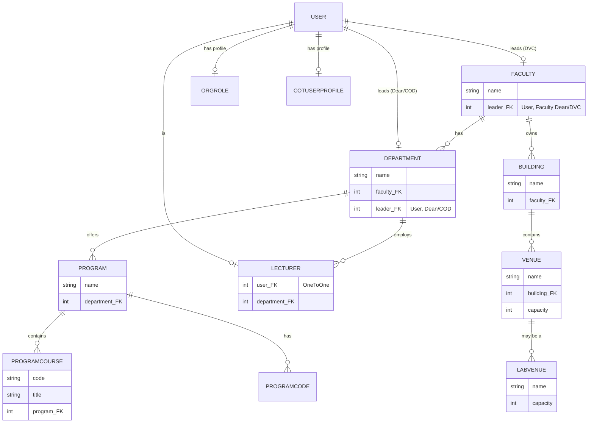

### 2. Course allocation domain (`course_allocation`)

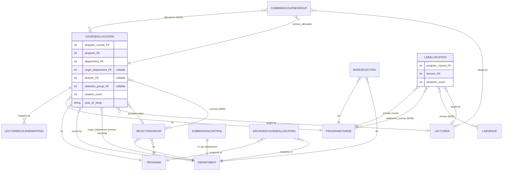

### 3. Core timetabling engine (`timetable`)

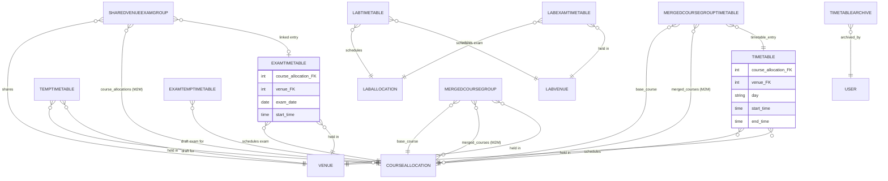

### 4. Resit timetabling domain (`resits_timetabling`) — current focus area

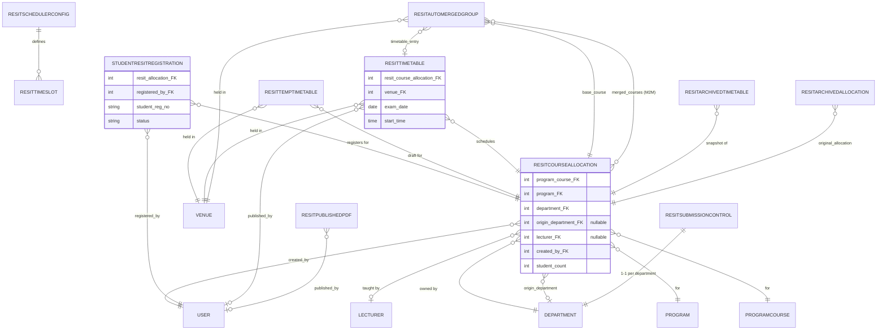

### 5. Multi-campus timetabling (`campuses_timetable`)

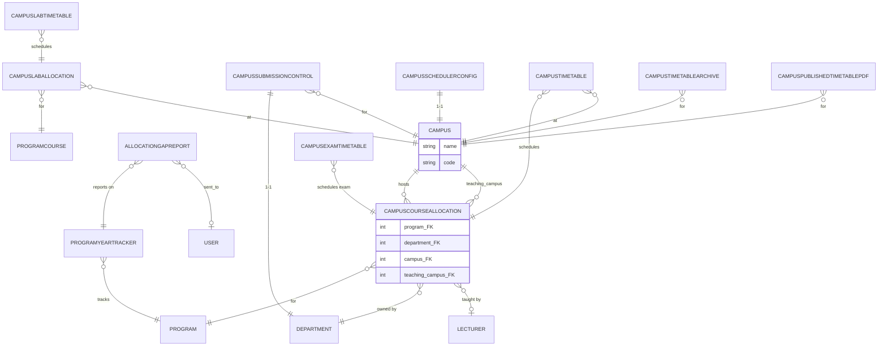

### 6. ODEL system (`odel_system`)

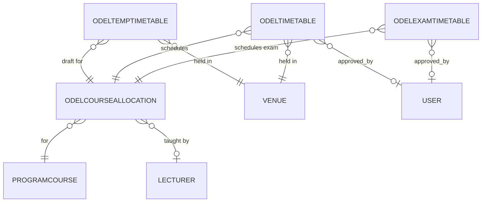

### 7. Documentation module (`documentation`)

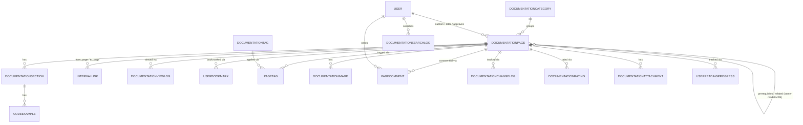

### 8. Identity, roles & support systems

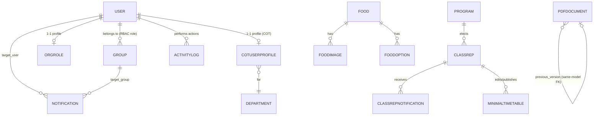

> **Note on diagram scope:** these ERDs are derived directly from each app's `models.py` (`ForeignKey` / `OneToOneField` / `ManyToManyField` declarations) at the time of writing. As the schema evolves (new fields, new migrations), re-derive the diagrams from the models rather than hand-editing them, to avoid drift.

---

## RBAC — Role-Based Access Control

All access control lives in **`core/rbac.py`** — one file, one source of truth. Full reference: **[`RBAC.md`](RBAC.md)**. Summary below.

### How it works

- No custom `AUTH_USER_MODEL` — roles are modelled as Django's built-in `auth.Group`, normalised through one canonical `Role` class and an alias-resolution table (`ROLE_ALIASES`) so legacy/inconsistent group-name strings used across older view code still resolve correctly.
- Groups are **seeded automatically** on every `python manage.py migrate` via `core/signals.py` → `DEFAULT_GROUPS` (`dvc`, `dvc_admins`, `dean`, `dean_admins`, `cod`, `cod_admins`, `director_timetable`, `timetable_admins`, `department_users`, plus `timetabler`, `sudo`, `cot`, `utility`, `academic_affairs`, `lecturer` referenced as canonical roles).
- `Role.CLASSREP` is **not** a Django Group — Class Reps authenticate through a separate plain-session mechanism (`request.session['classrep_id']`), guarded by `classrep_required()` instead of `allowed_roles()`.

### Connection flow (request → permission decision)

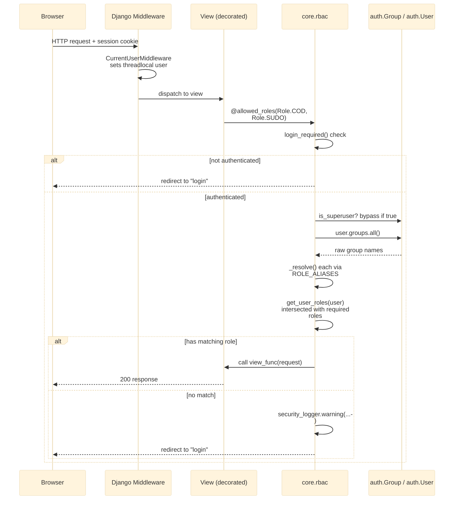

### Template-level role context

`core.rbac.rbac_context` is registered as a global context processor (see `TEMPLATES.OPTIONS.context_processors` in `settings.py`), so **every template** automatically receives:

| Context variable | Type | Meaning |
|---|---|---|
| `user_roles` | `set[str]` | Canonical roles held by the logged-in user |
| `is_management` | `bool` | `True` if any held role is in `MANAGEMENT_ROLES` (COD/Dean/DVC/Director/Timetable Admin/Sudo tier and above) |

This lets templates do `` or `` without per-view boilerplate.

### Role reference table

| Role constant | Group name in DB | Represents |
|---|---|---|
| `Role.DVC` | `dvc` | Deputy Vice Chancellor |
| `Role.DVC_ADMIN` | `dvc_admins` | DVC support staff |
| `Role.DEAN` | `dean` | Faculty Dean |
| `Role.DEAN_ADMIN` | `dean_admins` | Dean support staff |
| `Role.COD` | `cod` | Chair of Department / HOD |
| `Role.COD_ADMIN` | `cod_admins` | COD support staff |
| `Role.DIRECTOR` | `director_timetable` | Director of Timetabling |
| `Role.TIMETABLE_ADMIN` | `timetable_admins` | Timetabling support staff |
| `Role.TIMETABLER` | `timetabler` | Timetabling officer |
| `Role.SUDO` | `sudo` | Super-admin operator |
| `Role.COT` | `cot` | Controller of Teaching |
| `Role.UTILITY` | `utility` | Utility office (venues) |
| `Role.ACADEMIC_AFFAIRS` | `academic_affairs` | Academic Affairs office |
| `Role.DEPARTMENT_USERS` | `department_users` | General department staff |
| `Role.LECTURER` | `lecturer` | Lecturer (read-only access) |
| `Role.CLASSREP` | *(session-based, not a Group)* | Class Rep |

Pre-built tier sets (`HOD_AND_ABOVE`, `MANAGEMENT_ROLES`) are available from `core.rbac` for views/templates that need "department head and above" checks without listing every role.

**Usage pattern for new views:**

```python
from core.rbac import allowed_roles, Role

@allowed_roles(Role.COD, Role.COD_ADMIN, Role.SUDO)
def my_view(request):
    ...

# Class Rep views use the separate session-based guard:
from core.rbac import classrep_required

@classrep_required
def classrep_dashboard(request):
    ...
```

See **[`RBAC.md`](RBAC.md)** for the complete role catalogue, permission map, and migration notes from the old scattered `@login_required` pattern.

---

## Request Lifecycle

End-to-end view of middleware ordering, from `settings.py` → `MIDDLEWARE`:

```mermaid
%%{init: {'theme': 'base', 'themeVariables': {'fontSize': '17px'}, 'flowchart': {'htmlLabels': true, 'wrappingWidth': 220, 'nodeSpacing': 45, 'rankSpacing': 55, 'padding': 16}}}%%
flowchart LR
    A["`1. SecurityMiddleware`"] --> B["`2. WhiteNoiseMiddleware
(static files)`"]
    B --> C["`3. SessionMiddleware`"]
    C --> D["`4. CommonMiddleware`"]
    D --> E["`5. CsrfViewMiddleware`"]
    E --> F["`6. AuthenticationMiddleware
(request.user)`"]
    F --> G["`7. MessageMiddleware`"]
    G --> H["`8. XFrameOptionsMiddleware`"]
    H --> I["`9. CurrentUserMiddleware
(threadlocal user for signals)`"]
    I --> J["`10. RequestLoggingMiddleware
(logs 500s to django.request)`"]
    J --> K["`11. SecurityHeadersMiddleware
(adds security response headers)`"]
    K --> L["`12. RatelimitMiddleware`"]
    L --> M["`URL dispatch to view`"]
    M --> N["`allowed_roles() / classrep_required()`"]
    N --> O["`View logic + ORM`"]
    O --> P["`Template render
(rbac_context injects user_roles)`"]
    P --> Q["`Response`"]
```

---

## Project Structure

```
university_timetabling/
│
├── university_timetable_system/    ← Django project config
│   ├── settings.py                 ← All settings (loads from .env)
│   ├── urls.py                     ← Root URL configuration
│   ├── wsgi.py
│   └── asgi.py
│
├── core/                           ← Auth, RBAC, middleware, site settings
│   ├── rbac.py                     ← Single source of truth for roles & permissions
│   ├── middleware.py               ← CurrentUser / RequestLogging / SecurityHeaders
│   ├── signals.py                  ← DEFAULT_GROUPS seeding, ROLE_PERMISSION_MAP
│   ├── models.py                   ← SiteSettings, SitePhoto, OrgRole, CotUserProfile, ActivityLog
│   └── templates/core/
│
├── admins/                         ← Sudo admin panel
├── api/                            ← REST/AJAX endpoints
├── classreps/                      ← Class rep portal (session-based auth)
├── course_allocation/              ← Course–lecturer–program allocation engine
├── course_management/              ← COD panel, department timetable
├── dashboards/                     ← Public site, portals, analysis dashboard
├── department_management/          ← Dean panel
├── export_import/                  ← PDF/CSV export + smart bulk import
├── faculty_management/             ← DVC panel
├── feedback/                       ← Feedback form + chatbot widget
├── help_system/                    ← Placeholder app (not yet routed)
├── lecturer_portal/                ← Lecturer allocation views
├── mess/                           ← Canteen/mess management
├── notifications/                  ← Notification system
├── program_management/             ← Program/course catalogue
├── room_management/                ← Building/Venue/LabVenue management
├── timetable/                      ← Core scheduling engine
│   └── algorithms/                 ← Scheduling algorithm implementations
├── odel_system/                    ← ODEL/distance learning timetable
├── campuses_timetable/             ← Multi-campus timetabling + tracker
├── documentation/                  ← In-system documentation/knowledge base
├── resits_timetabling/             ← Resit scheduling module (current focus area)
│
├── documentation_data_scripts/     ← One-off scripts seeding documentation content
├── feasibility_reports/            ← Generated diagnostic reports (not an app)
│
├── templates/                      ← Global templates
│   ├── base.html                   ← Root HTML shell
│   └── emails/
│
├── static/
│   ├── css/                        ← website.css, panel.css, dashboard.css, base.css, ...
│   └── js/                         ← dashboard.js, panel.js, feedback-widget.js, ...
│
├── docker/
│   ├── nginx/default.conf
│   └── mysql/conf.d/timetabling.cnf
│
├── manage.py
├── documentation_seed.py
├── requirements.txt
├── Dockerfile
├── docker-compose.yml
├── docker-entrypoint.sh
├── .dockerignore
├── .env.example
├── README.md
├── DEVELOPER_DOCS.md
└── RBAC.md
```

> For the full file-by-file breakdown of each app's views, templates, and CSS/JS pairings, see **[`DEVELOPER_DOCS.md`](DEVELOPER_DOCS.md)**.

---

## Template Inheritance

```
templates/base.html                                   ← ROOT (global HTML shell)
│
├── dashboards/templates/dashboard/base.html           ← Public pages
│   ├── unios_homepage.html      (+ motivational ticker, feedback widget)
│   ├── student_portal.html      (+ feedback widget)
│   ├── staff_portal.html        (+ feedback widget)
│   └── view_timetable.html, analysis_dashboard.html, ...
│
├── dashboards/templates/dashboard/dashboard_base.html ← Green sidebar admin
│   ├── user_dashboard.html, venues_panel.html, lab_timetable.html, ...
│
├── timetable/templates/timetable/base.html            ← Navy panel pages
│   ├── timetable_panel.html, autoscheduler_base.html, schedule_main_exam.html, ...
│
├── admins/templates/admins/sudo_base.html              ← Sudo admin
│   ├── sudo_dashboard.html, sudo_homepage.html, ...
│
└── core/templates/core/
    ├── login.html                                       ← No navbar/footer
    └── error.html                                        ← 403/404/500
```

---

## Local Development (without Docker)

### 1. Clone the repository
```bash
git clone https://github.com/DRAVIS55/university_timetable_system.git
cd university_timetabling
```

### 2. Create and activate a virtual environment
```bash
python3 -m venv env
source env/bin/activate        # Linux/macOS
env\Scripts\activate           # Windows
```

### 3. Install dependencies
```bash
pip install -r requirements.txt
```

> **Note:** WeasyPrint requires system-level libraries (Cairo, Pango). See the [WeasyPrint docs](https://doc.courtbouillon.org/weasyprint/stable/first_steps.html) for your OS.

### 4. Configure environment variables
```bash
cp .env.example .env
# Edit .env — set DB credentials, SECRET_KEY, email settings
```

### 5. Apply migrations & start
```bash
python manage.py migrate    # also seeds DEFAULT_GROUPS via core/signals.py
python manage.py createsuperuser
python manage.py runserver
```

Open: [http://127.0.0.1:8000](http://127.0.0.1:8000)

### 6. (Optional) Seed documentation content
```bash
python documentation_seed.py
```

---

## Docker Deployment

### Prerequisites
- [Docker Desktop](https://www.docker.com/products/docker-desktop/) (or Docker Engine + Compose plugin on Linux)

### Quick Start
```bash
# 1. Copy and fill in environment variables
cp .env.example .env
#    → Set DB_PASSWORD, SECRET_KEY, ALLOWED_HOSTS, email settings

# 2. Build and start all services (db + web + nginx)
docker compose up --build

# 3. Open the app
#    HTTP  → http://localhost
#    HTTPS → https://localhost  (after placing certs in docker/nginx/certs/)
```

### Services

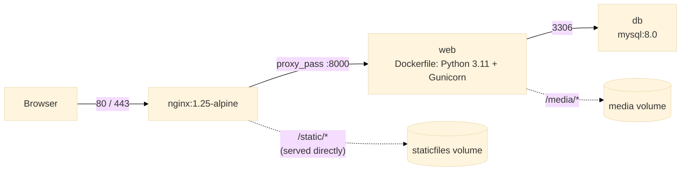

| Service | Image | Port |
|---|---|---|
| `db` | `mysql:8.0` | 3306 |
| `web` | Built from `Dockerfile` (Python 3.11 + Gunicorn) | 8000 (internal) |
| `nginx` | `nginx:1.25-alpine` | 80, 443 |

### SSL / HTTPS
Place your certificate files in `docker/nginx/certs/`:
```
docker/nginx/certs/fullchain.pem
docker/nginx/certs/privkey.pem
```
For free certificates use [Certbot / Let's Encrypt](https://certbot.eff.org/).

If you don't have SSL yet, edit `docker/nginx/default.conf` to use the plain HTTP block (instructions are commented inside the file).

### Useful Commands
```bash
# Run in background
docker compose up -d --build

# View logs
docker compose logs -f web
docker compose logs -f nginx

# Run Django management commands
docker compose exec web python manage.py createsuperuser
docker compose exec web python manage.py migrate
docker compose exec web python manage.py collectstatic --noinput

# Shell inside web container
docker compose exec web bash

# Stop everything
docker compose down

# Stop and remove volumes (wipes database!)
docker compose down -v
```

### Startup sequence (`docker-entrypoint.sh`)
1. Polls the database with a Django connection check (up to 30 retries × 1 s)
2. Runs `python manage.py migrate --noinput` (also seeds RBAC groups)
3. Starts `gunicorn university_timetable_system.wsgi:application`

### Docker File Structure
```
Dockerfile                  ← Multi-stage build (builder + runtime)
docker-entrypoint.sh        ← Waits for DB → runs migrations → starts Gunicorn
docker-compose.yml          ← Orchestrates db + web + nginx
.dockerignore               ← Excludes venv, .git, secrets from build context
docker/
  nginx/
    default.conf            ← Nginx reverse proxy + static/media serving
    certs/                  ← Place SSL certs here (not committed)
  mysql/
    conf.d/
      timetabling.cnf       ← MySQL tuning (utf8mb4, InnoDB settings)
```

---

## Environment Variables Reference

See `.env.example` for the full list.

| Variable | Description | Default |
|---|---|---|
| `SECRET_KEY` | Django secret key | *(set your own — do not reuse the example)* |
| `DEBUG` | `true` / `false` | `true` |
| `ALLOWED_HOSTS` | Comma-separated hostnames | `127.0.0.1,localhost` |
| `CSRF_TRUSTED_ORIGINS` | Comma-separated trusted origins for CSRF | *(empty)* |
| `DB_ENGINE` | Database backend | `django.db.backends.mysql` |
| `DB_NAME` | Database name | `timetabling_db` |
| `DB_USER` | Database user | `timetabling_db` |
| `DB_PASSWORD` | Database password | *(empty — set your own)* |
| `DB_HOST` | Database host | `localhost` (use `db` in Docker) |
| `DB_PORT` | Database port | `3306` |
| `EMAIL_BACKEND` | Django email backend | `django.core.mail.backends.smtp.EmailBackend` |
| `EMAIL_HOST` | SMTP server | *(empty)* |
| `EMAIL_PORT` | SMTP port | `587` |
| `EMAIL_USE_TLS` | Use TLS for SMTP | `True` |
| `EMAIL_HOST_USER` | SMTP user | *(empty)* |
| `EMAIL_HOST_PASSWORD` | SMTP password / app password | *(empty)* |
| `DEFAULT_FROM_EMAIL` | Default "From" header | *(empty)* |
| `SUPPORT_EMAIL` | Support contact shown in-app | *(empty)* |
| `NGROK_AUTHTOKEN` | Optional dev tunneling token | *(empty)* |
| `USE_S3` | Enable S3 media storage | `false` |

---

## Further Documentation

| Document | Covers |
|---|---|
| **[`DEVELOPER_DOCS.md`](DEVELOPER_DOCS.md)** | File-by-file project tree, CSS/JS architecture, design tokens, page-type conventions, "how to add a new page" recipes, feedback widget internals, motivational ticker internals, Docker developer notes, changelog |
| **[`RBAC.md`](RBAC.md)** | Full role catalogue, `ROLE_ALIASES`, permission map, decorator usage patterns, migration guide from legacy auth checks |
| `University Timetable System Description - DeepSeek.pdf` | Original system/requirements description |
| `ODEL System Description - DeepSeek.pdf` | ODEL module requirements description |
| `/documentation/` (in-app, `documentation` module) | Living, searchable knowledge base seeded from `documentation_data_scripts/` |

---

## Author

**Samuel Kibunja**
Software Developer | Intelligent Systems Enthusiast

---

## License

**Proprietary — All Rights Reserved.**

This software is developed to solve real-world university timetabling problems globally. It is **not open source**. No part of this codebase may be copied, modified, distributed, sublicensed, or used in any form without explicit written permission from the author.

© 2026 Samuel Kibunja. All rights reserved.# chuka_timetabling
